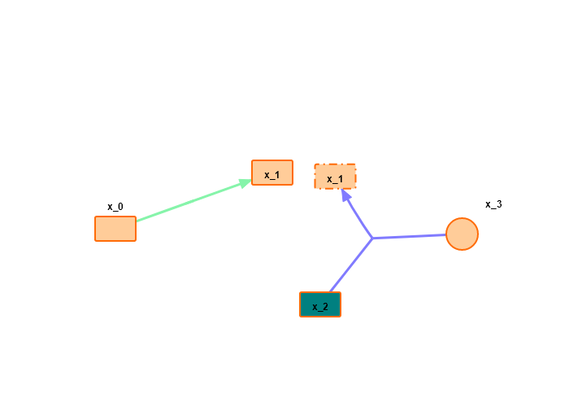
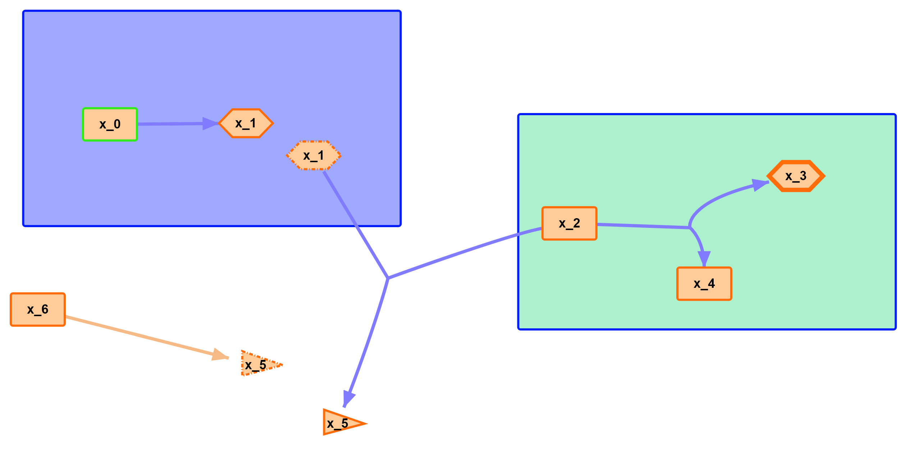
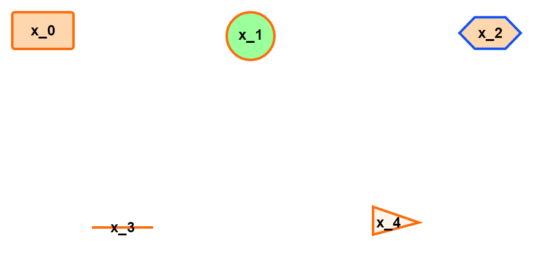
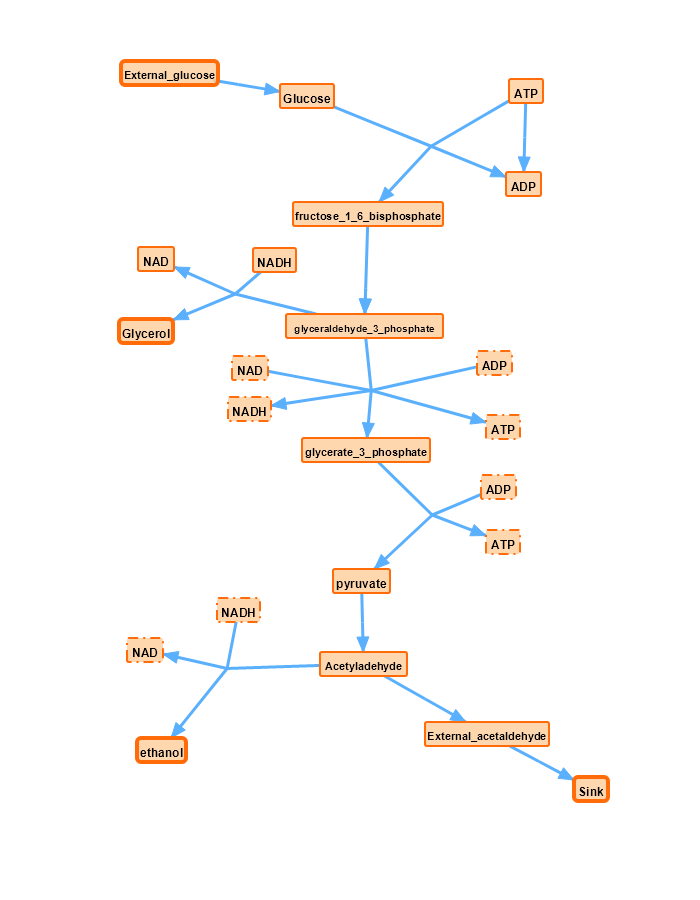

.. SBMLDiagrams documentation master file, created by
   sphinx-quickstart on Mon Nov  8 14:18:50 2021.
   You can adapt this file completely to your liking, but it should at least
   contain the root `toctree` directive.

Welcome to SBMLDiagrams's documentation!
========================================

.. toctree::
   :maxdepth: 2
   :caption: Contents:

   visualizeSBML
   processSBML

------------
Introduction
------------

SBMLDiagrams is a Python package to visualize the networks embedded in SBML Level 3 models. 
If the SBML layout and render extension are used, the package will use this data to visualize the 
network. SBMLDiagrams can export PNG, JPG, PDF files. SBMLDiagrams can be used to add SBML layout 
and render to an existing SBML model which can subsequently be exported. If you use this python 
package, please cite the Gihub website (https://github.com/SunnyXu/SBMLDiagrams).

------------
Installation 
------------

To install SBMLDiagrams use

.. code-block:: python
   
   pip install SBMLDiagrams

-------------
Code Examples
-------------

1) Load and visualize an SBML file.

.. code-block:: python

   import SBMLDiagrams
   import os 

   dirname = "path//to"
   filename = "test.xml"

   f = open(os.path.join(dirname, filename), 'r')
   sbmlStr = f.read()
   f.close()

   df = SBMLDiagrams.load(sbmlStr)
   df.plot()

2) Load, read, edit and export to an SBML file.

.. code-block:: python

   import SBMLDiagrams
   import os

   dirname = "path//to"
   filename = "test.xml"

   f = open(os.path.join(dirname, filename), 'r')
   sbmlStr = f.read()
   f.close()

   df = SBMLDiagrams.load(sbmlStr)

   print(df.getCompartmentPosition("compartment_id"))
   print(df.getNodeFillColor("node_id"))
   print(df.isBezierReactionType("reaction_id"))

   # There are three ways to set colors and opacity is optional:
   # 1) list-decimal_rgb 1*3 matrix, i.e. [255, 255, 255];
   # 2) str-html_name, i.e. "white";
   # 3) str-hex_string (6-digit), i.e. "#000000";
   # Please see more details on the page of processSBML. 
   df.setCompartmentBorderColor("compartment_id", [255, 255, 255])
   df.setCompartmentFillColor("compartment_id", "white", opacity = 0.5)
   df.setNodeTextFontColor("node_id", "#000000", opacity = 1.)
   df.setNodeSize("node_id", [50.0, 30.0])
   df.setReactionLineThickness("reaction_id", 3.)

   sbmlStr_layout_render = df.export()
   f = open("output.xml", "w")
   f.write(sbmlStr_layout_render)
   f.close()

---------------
Figure Examples
---------------

1) An example without compartment. There are different shapes of nodes with different fill colors. 
Texts can be placed outside the nodes with designed positions. There are also reactions with different 
fill colors. x_1 is an example of alias node.

2) An example with compartments. The compartments are filled with different colors. There are 
different shapes of nodes with different border colors. x_1 and x_5 are examples of alias nodes.

3) An example with only nodes (no reactions in the network). There are five types of node shapes
with different fill colors and border colors.

4) An example with long text contents.

